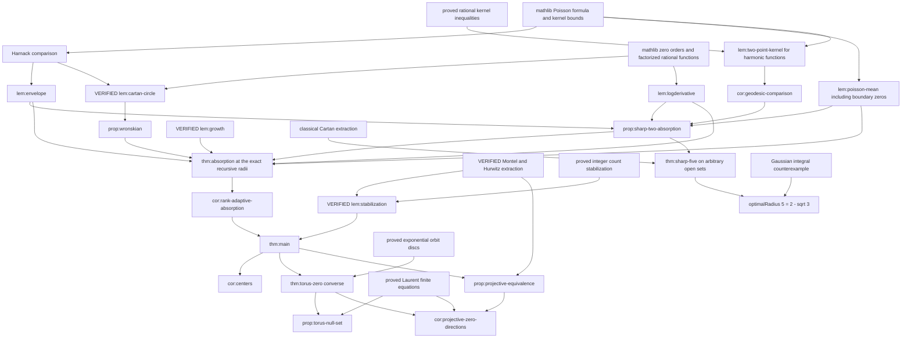

# Proof dependency graph

Solid analytic nodes below are proof obligations until marked VERIFIED in PROGRESS.md. An arrow means the proof at the target uses the source.

The sharp two-term absorption branch must remain independent of general absorption, avoiding a circular proof of the m = 2 base radius.
