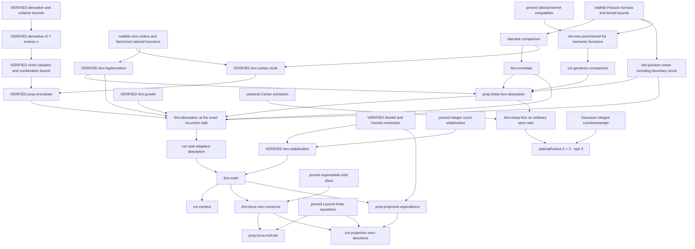

# Proof dependency graph

Solid analytic nodes below are proof obligations until marked VERIFIED in PROGRESS.md. An arrow means the proof at the target uses the source.

The sharp two-term absorption branch must remain independent of general absorption, avoiding a circular proof of the m = 2 base radius.

## Proved absorption preparations

`HolomorphicCancellation` proves the m = 1 base case. `CombinationMinimum + Rescaling + AbsorptionLinearAlgebra → AbsorptionReduction → AbsorptionGap` proves the positive combination gap from the lower-dimensional induction hypothesis and failure of the conclusion. `FailurePoints → FiniteFailurePoints` constructs actual failure points. `PoissonExtension → HarmonicGrowth + PoissonHarnack → PoissonEnvelope` constructs and bounds the harmonic majorant. `UnitGrowth + GrowthSelection + ZeroFreeAnnulus` supplies divergence and controlled radii.

`WronskianScaling + QuantitativeWronskian → AbsorptionWronskian` supplies actual points with a uniform logarithmic lower bound. `WronskianBoundary + CircleExceptional → WronskianMean` supplies both mean upper bounds with boundary zeros allowed. `ConvergenceJets + NegligibleDerivatives → BoundaryErrorLimit` supplies a genuine little-o error. `LogPoisson + Radii → AbsorptionComparison` supplies the final numerical contradiction. `AbsorptionInduction` assembles all these results into the proved successor step with the exact η. Full absorption still depends on the sharp two-term base case.

## Completed logarithmic derivative chain

`ProximityGrowth → ZeroCount → LocalLogDerivativePoles → LogDerivativeConstants` supplies the actual finite poles and polynomial bounds. `AngularIntegrals + FractionalPowers + CircleExceptional + ProximityMoment → PoleMoments` supplies the mean estimate across boundary poles. Together with `LogarithmicGrowthAlgebra` these prove `IteratedLogDerivativeMean`. `ProximityLocal → DerivativeQuotientRecurrence`, followed by strong induction, proves the full `LogDerivativeEstimate`. The absorption proof can now use this lemma without a relative assumption.
