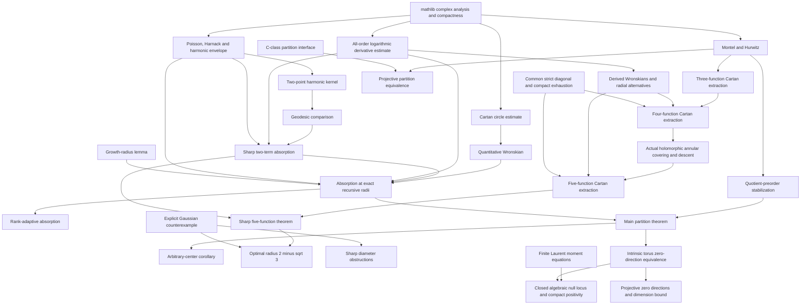

# Completed proof dependencies

All manuscript nodes below have actual proof terms. The final kernel audit is recorded in ../verification/result.json and ../verification/axiom-summary.json. Arrows summarize the mathematical proof structure; the exact compiler import graph is in ../verification/dependencies.json.

## Acyclic absorption proof

The sharp two-term proof uses the analytic toolbox and the two-point geometry. It does not assume general reciprocal absorption. Its exact sharp-radius consequence supplies the m = 2 base case. The higher-rank Wronskian induction then proves general absorption with r1 = 1, r2 = 2 - sqrt 3 and r_m = r_(m-1)/(1024*(K_m+m)). The Wronskian exponent sequence is constructed, not postulated.

## Main partition proof

A single extraction stabilizes every quotient on the finitely many radii. Finite maximal-class counting supplies a stable layer. The actual assignment of indices to representatives gives bounded normalized sums. A nonzero limit contradicts absorption and compact escape; all normalized limits therefore vanish. This proves a genuine C-class partition at epsilon_p = r_(p-1)^(p-1). Bounded elimination gives the rank-adaptive corollary without an extra basis assumption.

## Classical Cartan proof

See CARTAN_EXTRACTION.md for the exhaustive quotient-limit, merging, annular, higher-Wronskian and diagonal chains. Branch conditions in auxiliary lemmas are eliminated in CartanFourLocal and CartanFiveLocal. The paper uses the proved p = 5 full-disk theorem.

## Geometry and optimality

The torus theorem uses the main partition theorem, differentiation of compactly bounded ratios and finite exponential moments. ManifoldDiscs proves equality of the intrinsic metric and the actual coordinate-disk infimum. TorusTangentAlgebraic identifies the full null image with an explicit polynomial zero locus. Projective constructions use the true quotient topology, complex charts, product uniformity and actual differentials. See GEOMETRIC_MODEL.md for the complete correspondence.

The Gaussian chain proves the holomorphic square-root branch, real-part identities and sign, contour-tail bounds, exact 3/(4n) quotient bounds, all five unit conditions, zero sum, growth at zero, vanishing at opposite points and impossibility of every extracted C-class partition beyond the sharp radius. SharpFive combines the lower and upper radius bounds; the disk-diameter formula also gives both diameter obstructions.
